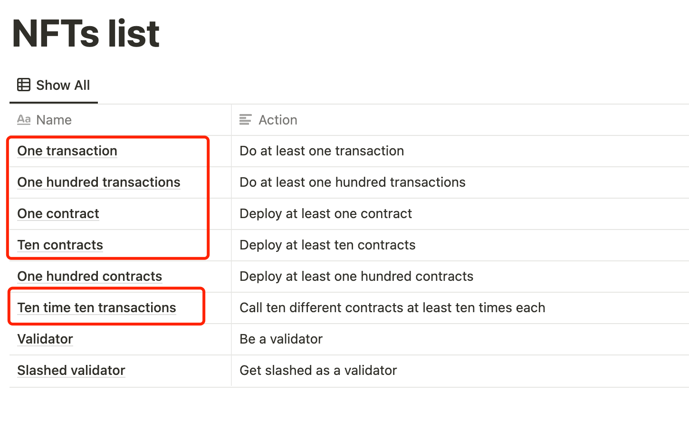

# kiln_testnet
deploy and interact with your own contracts


## 1.获取测试币
前往 http://kiln-faucet.pk-net.net/ 进行Pow领测试币

## 2.下载及配置
* ###  克隆项目
```
git clone https://github.com/zefzhou/kiln_testnet.git
```
* ### 安装python3依赖包
```
cd kiln_testnet
pip3 install -r requirements.txt
```
* ### 配置私钥
新建.env文件
```
cp .env.example .env
.env文件中的 PRIVATE_KEY=xxxx 将xxxx替换为自己的测试钱包私钥
```

## 3.运行
```
python3 deploy.py
```
会分别提示你需要部署的合约数量和单个合约交互的次数，建议两次都输入11，保险起见大部分任务都能达成


